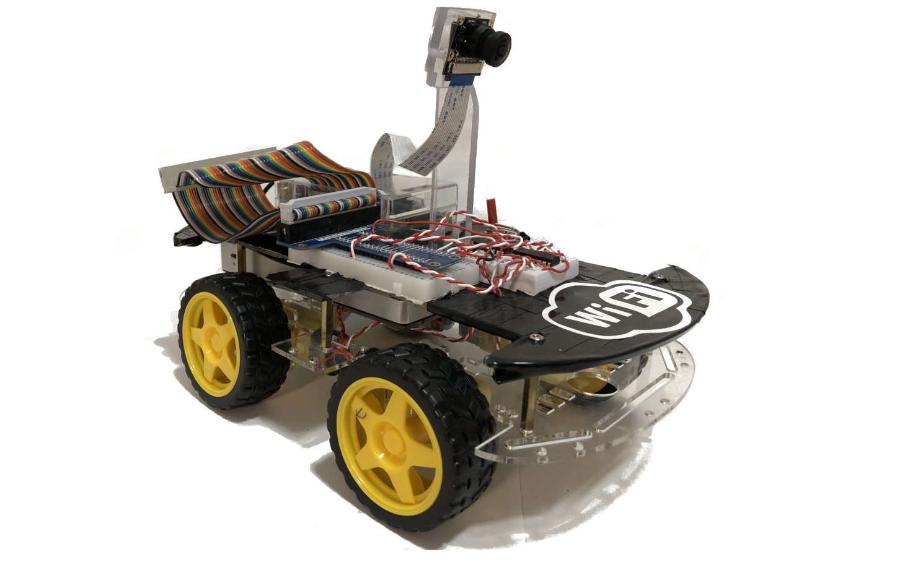
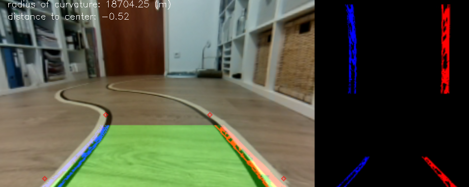

### version-2: Softwaremodul zur Fahrspurerkennung in Videoechtzeit für autonome Modellfahrzeuge
* * * *
#### Modellfahrzeug Ruby

* * * *
#### Beispiel der Spurerkennung an einer Teststrecke (im Arbeitszimmer) :house:

In diesem Projekt wurden Computer Vision Techniken verwendet, um Fahrspurbegrenzungen zu identifizieren.

Um dies zu erreichen, werden die folgenden Schritte durchgeführt:
- Berechnen der Kamerakalibriermatrix und der Verzerrungskoeffizienten der verwendeten Kamera anhand einer Reihe von Schachbrettbildern, die von derselben Kamera aufgenommen wurden.
- Entzerren der einzelen Frames anhand der zurvor errechneten Matrizen
- Umwandeln des Originalsbildes in den HLS-Farbraum und anwendung des Sobel-Algorithmus um:
  - Isolieren der Gelben Farbe: Gelbe Fahrbahnmarkierung
  - Isolieren der Weißen Farbe: Weiße Fahrbahnmarkierung
- Bitweise ODER gelbe und weiße Masken, um eine gemeinsame Maske zu erhalten.
- Perspektivische Transformation, um eine "Vogelperspektive" des Bildes zu erhalten
  - src (sorce) und- dst (destination) Parameter um die Transformierten Bereiche zu definieren.
- Bestimmen andhand des Binärbild die am besten geeignete Kurve für jede Spur durch Polynomische Anpassung. Dazu wird für jede Fahrspur ein Polynom zweiter Ordnung bestimmt.
  - Es wird ein Histogramm berechnet, um die Position der Fahrspur an der x-Achse zu bestimmen.
  - Das Bild wird in 9 horizontale Schichten aufgeteilt
  - Plazieren eines Fensters um den Mittelpunkt der Spur
  - Plazieren der weiteren  8 Fenster um den Mittelpunklt des vorherigen Fensters. Diese Methode Folgt der "Spur" bis zum oberen Rand des Binärbildes und beschleunigt die Verarbeitung indem es nur nach aktiven Pixeln über einen kleinen Teil des Bildes sucht.
  - Pixel, die zu jeder Spurlinie gehören, werden identifiziert und die Numpy polyfit()-Methode wird ein Polynom zweiter Ordnung errchnet
- Output frame wird erzeugt aus den errechneten Fahrspurbegrenzungen und dem entzerrten Input frame

## Anforderungen/Requirements 
- numpy
- opencv
- python3 
- picamera

## Wichtige Links

- Video Anleitung für OpenCV für den Raspberry pi
- - https://www.youtube.com/watch?v=ZuhPzP5lt9U&list=LL0DRCOCzI5IYxkaMweeubRA&index=13&t=1832s
